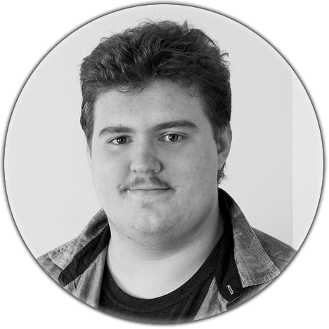

    

      
     
    
## About jkniest.de

jkniest.de is a personal portfolio for me. It is created with the laravel framework. If you want to use
this project as a base for your own portfolios feel free to download, copy or fork this project.

## Installation

Install this project by cloning this repository and install like every other laravel application

- Run `composer install` inside the root directory of your project
- Run `npm install` inside the root directory of your project
- Copy `.env.example` to `.env` and modify the relevant data
- Run `php artisan key:generate` to generate a new encryption key
- Add a cron entry: `* * * * * php /path/to/artisan schedule:run >> /dev/null 2>&1`
- Compile all media files: `php artisan media`
- Create project classloader: `php artisan projects:load`
- Run `./vendor/bin/phpunit` to test if everything is working

## License

Copyright (C) 2017 Jordan Kniest   
   
This program is free software: you can redistribute it and/or modify   
it under the terms of the GNU Affero General Public License as published by   
the Free Software Foundation, either version 3 of the License, or   
(at your option) any later version.   
   
This program is distributed in the hope that it will be useful,   
but WITHOUT ANY WARRANTY; without even the implied warranty of   
MERCHANTABILITY or FITNESS FOR A PARTICULAR PURPOSE.  See the   
GNU Affero General Public License for more details.   
   
You should have received a copy of the GNU Affero General Public License   
along with this program.  If not, see <http://www.gnu.org/licenses/>.